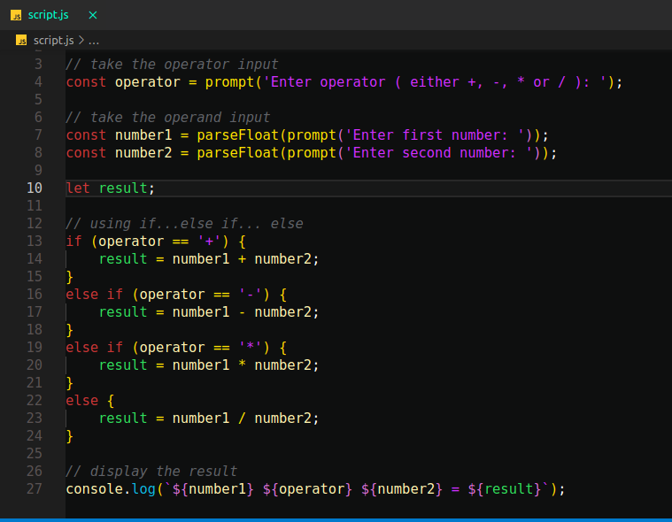

 <a href="https://marketplace.visualstudio.com/items?itemName=brogang.brogang" rel="noopener">
 
    </a>


<h3 align="" >Bro Gang Dark Theme</h3>


---
## 📝 Table of Contents

- [About](#about)
- [Getting Started /Installation](#install)


- [Preview](#preview)
    ##### [HTML](#html)
    ##### [JS](#js)
    ##### [CSS](#css)
    ##### [CPP](#cpp)
    ##### [Python](#python)
    ##### [Java](#java)


---

<p align="" id="preview"> Bro Gang Dark Theme for Visual Studio Code
    <br> 
</p>
<!-- image preview section -->

   <!--  -->
<h3 align="" id="js">JS</h3>

 

<h3 align="" id="cpp">CPP</h3>

 

<h3 align="" id="python">Python</h3>

   
<h3 align="" id="html">HTML</h3>

   


<h3 align="" id="css">CSS</h3>

   

<h3 align="" id="java">Java</h3>

   


## 🧐 About Author
<p id="about">Hii, My name is Amresh Maurya . 
Enthusiastic graduate with  knowledge of coding . Proficient in C++, HTML 5,CSS3, JavaScript, and Java. Ability to learn new softwares and technologies quickly.

</p>
<a name = "about" align=""href="https://www.linkedin.com/in/amresh9/">
   Amresh Maurya
</a>


- [@ursamresh](https://github.com/Amresh9/brogang) - Idea & Work


### Installing
<p id="install"></p>
Follow the steps given below .

Run this Command in your vs code Terminal

```
ext install brogang.brogang
```

or Search in Extension Search-Box below Keywords

```
brogang, Amresh Maurya ,Bro Gang Dark Theme
``` 


